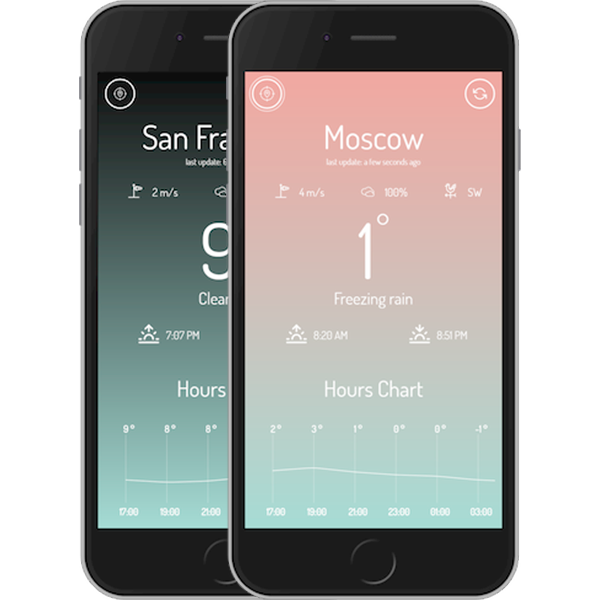

# Vue weather PWA 🌤

A simple, progressive web weather app built with Vue.js, created for learning purpose. PWA can be installed on home screen, work in offline with cached data, and use device geolocation abilities for get forecast.

<p align="center">
  
</p>

Theme of app was inspired by [Minimal Weather App](https://dribbble.com/shots/6086009-Minimal-Weather-App).

## Built With
* [Vue.js](https://vuejs.org/)
* [VueCLI](https://cli.vuejs.org/)
* [VSCode](https://code.visualstudio.com/)

## Used packages and components
* [Day.js](https://github.com/iamkun/dayjs)
* [Axios](https://github.com/axios/axios)
* [v-tooltip](https://github.com/Akryum/v-tooltip)
* [vue-dragscroll](https://github.com/donmbelembe/vue-dragscroll)
* [vuetrend](https://github.com/QingWei-Li/vue-trend)
* [vuex](https://vuex.vuejs.org/)
* [vuex-persistedstate](https://github.com/robinvdvleuten/vuex-persistedstate)

## APIs
* https://ipwhois.io/ - IP Geolocation API
* https://www.weatherbit.io/api - Weather API

## Used icons created by
* [Yun Liu](https://www.iconfinder.com/Neolau1119)
* [meen icons](https://www.iconfinder.com/meenicons.mee)
* [Becris](https://www.iconfinder.com/becris)
* [RNS Fonts](https://www.iconfinder.com/RNS_Fonts)
* [Zlatko Najdenovski](https://www.iconfinder.com/zlaten)
* [Unknown creator](https://www.iconfinder.com/colebemis)

## Project setup
```
npm install
```
#### Compiles and hot-reloads for development
```
npm run serve
```
#### Compiles and minifies for production
```
npm run build
```
#### Lints and fixes files
```
npm run lint
```
